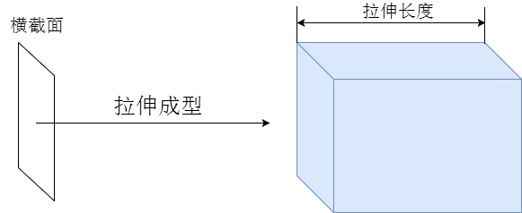
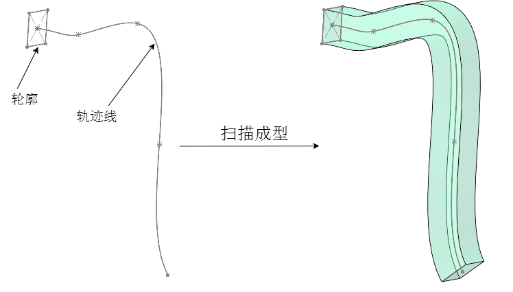

## 生成各种曲线和几何体

这个会用到一定的数学知识

## 先看一个储备知识，几何体方法.setFromPoints()

.setFromPoints()是几何体BufferGeometry的一个方法，通过该方法可以把数组pointsArr中坐标数据提取出来赋值给几何体。具体说就是把pointsArr里面坐标数据提取出来，赋值给geometry.attributes.position属性

二维数组和三维数组都可以

```js
const pointsArr = [
  // 三维向量Vector3表示的坐标值
  new THREE.Vector3(0,0,0),
  new THREE.Vector3(0,100,0),
  new THREE.Vector3(0,100,100),
  new THREE.Vector3(0,0,100),
];

// const pointsArr = [
//   // 二维向量Vector2表示的坐标值
//   new THREE.Vector2(0,0),
//   new THREE.Vector2(100,0),
//   new THREE.Vector2(100,100),
//   new THREE.Vector2(0,100),
// ];

// geometry.setFromPoints(pointsArr);
```


### 生成圆弧

我们知道圆形并不是一个纯粹的圆，而是由一系列的小线段组合而成的，那么我们只需要知道我们每个线段的两端点的坐标就可以了

可以想象一下，圆弧上的点的坐标是和sin。cos相关的，x Math.cos(angle); y Math.sin(angle);

```js
// 核心代码
const R = 100; //圆弧半径
const N = 50; //分段数量
const sp = 2 * Math.PI / N;//两个相邻点间隔弧度
// 批量生成圆弧上的顶点数据
const arr = [];
for (let i = 0; i < N; i++) {
  const angle =  sp * i;//当前点弧度
  // 以坐标原点为中心，在XOY平面上生成圆弧上的顶点数据
  const x = R * Math.cos(angle);
  const y = R * Math.sin(angle);
  arr.push(x, y, 0);//xyz坐标
}
```

### 曲线Curve

threejs提供了很多常用的曲线或直线API，可以直接使用。这些API曲线都有一个共同的父类Curve。

#### 椭圆EllipseCurve例子

结合getPoints，setFromPoints就能快速生成我们需要的形状

```js
// 参数1和2表示椭圆中心坐标  参数3和4表示x和y方向半径
const arc = new THREE.EllipseCurve(0, 0, 100, 50);
//getPoints是基类Curve的方法，平面曲线会返回一个vector2对象作为元素组成的数组
const pointsArr = arc.getPoints(50); //分段数50，返回51个顶点

const geometry = new THREE.BufferGeometry();
geometry.setFromPoints(pointsArr);

```

#### 圆形ArcCurve

//参数：0, 0圆弧坐标原点x，y  100：圆弧半径    0, 2 * Math.PI：圆弧起始角度

```js
const arc = new THREE.ArcCurve(0, 0, 100, 0, 2 * Math.PI);
```

#### 样条曲线

对于一些不规则的曲线，很难用一个圆、椭圆或抛物线函数去描述，这时候，可以使用threejs提供的样条曲线或贝塞尔曲线去表达。

```js
// 三维向量Vector3创建一组顶点坐标
const arr = [
  new THREE.Vector3(-50, 20, 90),
  new THREE.Vector3(-10, 40, 40),
  new THREE.Vector3(0, 0, 0),
  new THREE.Vector3(60, -60, 0),
  new THREE.Vector3(70, 0, 80)
]
// 三维样条曲线
const curve = new THREE.CatmullRomCurve3(arr);

const arr = [
  new THREE.Vector2(-100, 0),
  new THREE.Vector2(0, 30),
  new THREE.Vector2(100, 0),
];
// 二维样条曲线
const curve = new THREE.SplineCurve(arr);
```

#### 贝塞尔曲线

只需要观察语法规则就行了

- 二维二次贝塞尔曲线QuadraticBezierCurve
- 三维二次贝赛尔曲线QuadraticBezierCurve3
- 二维三次贝塞尔曲线CubicBezierCurve
- 三维三次贝赛尔曲线CubicBezierCurve3

无非就是控制的点变多了

```js
// p1、p2、p3表示三个点坐标
const p1 = new THREE.Vector3(-80, 0, 0);
const p2 = new THREE.Vector3(20, 100, 0);
const p3 = new THREE.Vector3(80, 0, 100);
// 三维二次贝赛尔曲线
const curve = new THREE.QuadraticBezierCurve3(p1, p2, p3);
```

#### 样条、贝塞尔曲线应用

表示一个飞线曲线轨迹有多重方案，圆弧、椭圆弧、贝塞尔、样条，比如加入购物车轨迹，地图大屏数据飞线

### 组合曲线CurvePath拼接曲线

通过threejs组合曲线CurvePath对象，你可以把直线、圆弧、贝塞尔等线条拼接为一条曲线。

```js
const CurvePath = new THREE.CurvePath();
CurvePath.curves.push(bezierCurve, splineCurve, line1);
//曲线上获取点
const pointsArr = CurvePath.getPoints(100); 
//读取坐标数据赋值给几何体顶点
geometry.setFromPoints(pointsArr); 
```
### ShapeGeometry

有些时候已知一个多边形的外轮廓坐标，想通过这些外轮廓坐标生成一个多边形几何体平面，这时候你可以借助threejs提供的轮廓填充ShapeGeometry几何体实现

```js
// 五边形
// 一组二维向量表示一个多边形轮廓坐标
const pointsArr = [
    new THREE.Vector2(-50, -50),
    new THREE.Vector2(-60, 0),
    new THREE.Vector2(0, 50),
    new THREE.Vector2(60, 0),
    new THREE.Vector2(50, -50),
]

// Shape表示一个平面多边形轮廓,参数是二维向量构成的数组pointsArr
const shape = new THREE.Shape(pointsArr);

const geometry = new THREE.ShapeGeometry(shape);
```

### ExtrudeGeometry
拉伸几何体ExtrudeGeometry和上节课讲到的轮廓填充几何体ShapeGeometry一样，都是基于一个基础的平面轮廓Shape进行变换，生成一个几何体。



可以由一个平面生成一个几何体

```js
// 一组二维向量表示一个多边形轮廓坐标
const pointsArr = [
  new THREE.Vector2(-50, -50), //多边形起点
  new THREE.Vector2(-50, 50),
  new THREE.Vector2(50, 50),
  new THREE.Vector2(50, -50),
]

// Shape表示一个平面多边形轮廓,参数是二维向量构成的数组pointsArr
const shape = new THREE.Shape(pointsArr);

const geometry = new THREE.ExtrudeGeometry(shape, {
  depth: 20, //拉伸长度
  bevelThickness: 10, //倒角尺寸:拉伸方向
  bevelSize: 5, //倒角尺寸:垂直拉伸方向
  bevelSegments: 20, //倒圆角：倒角细分精度，默认3
});
```

额外属性，可以控制连接位置
- bevelThickness
- bevelSize
- bevelSegments

#### 拉伸成一个曲线形状

其实可以简单想象一个，不沿着直线拉伸是不是就能得到一个曲线形状的几何体呢



### 自定义的Shape

多边形轮廓Shape,是直接通过一组二维向量Vector2表示的xy点坐标创建，Shape的父类是Path,Path提供了直线、圆弧、贝塞尔、样条等绘制方法，Shape也会从父类是Path继承这些图形绘制方法。

所以其实我们可以手动绘制shape，这个其实就是canvas的lineTo，moveTo等功能

```js
const shape = new THREE.Shape();
shape.moveTo(10, 0)

shape.lineTo(100, 0);
shape.lineTo(100, 100)
shape.lineTo(  10, 100)

const geometry = new THREE.ShapeGeometry(shape);
```

#### 还可以给多边形挖洞

```js
const path1 = new THREE.Path();// 圆孔1
path1.absarc(20, 20, 10);
const path2 = new THREE.Path();// 圆孔2
path2.absarc(80, 20, 10);
const path3 = new THREE.Path();// 方形孔
path3.moveTo(50, 50);
path3.lineTo(80, 50);
path3.lineTo(80, 80);
path3.lineTo(50, 80);

shape.holes.push(path1, path2,path3);
```
