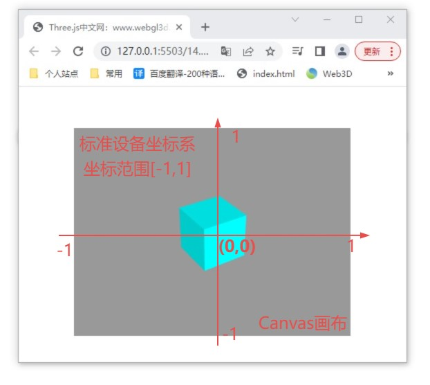

## 射线Ray

射线Ray和三维向量Vector3一样属于数学几何计算相关的API,可以进行射线交叉计算。

```js
// 创建射线对象Ray
const ray = new THREE.Ray()
// 设置射线起点
ray.origin = new THREE.Vector3(1,0,3);
// 或者
ray.origin.set(1, 0, 3);

// 射线方向
ray.direction = new THREE.Vector3(1,0,0);
// 表示射线沿着x轴负方向
ray.direction = new THREE.Vector3(-1,0,0);

```

## .intersectTriangle()方法

```js
// 三角形三个点坐标
const p1 = new THREE.Vector3(100, 25, 0);
const p2 = new THREE.Vector3(100, -25, 25);
const p3 = new THREE.Vector3(100, -25, -25);
const point = new THREE.Vector3();//用来记录射线和三角形的交叉点
// `.intersectTriangle()`计算射线和三角形是否相交叉，相交返回交点，不相交返回null
const result = ray.intersectTriangle(p1,p2,p3,false,point);
```

`.intersectTriangle()`计算射线和三角形是否相交叉，相交返回交点，不相交返回null

## Raycaster(射线拾取模型)

射线投射器Raycaster具有一个射线属性.ray

射线投射器Raycaster通过.intersectObjects()方法可以计算出来与自身射线.ray相交的网格模型。

.intersectObjects([mesh1, mesh2, mesh3])对参数中的网格模型对象进行射线交叉计算,未选中对象返回空数组[],选中一个对象，数组1个元素，选中多个对象，数组多个元素，如果选中多个对象，对象在数组中按照先后排序。

.intersectObjects()射线拾取返回信息

```js
const raycaster = new THREE.Raycaster();
raycaster.ray.origin = new THREE.Vector3(-100, 0, 0);
raycaster.ray.direction = new THREE.Vector3(1, 0, 0);
// 射线发射拾取模型对象
const intersects = raycaster.intersectObjects([mesh1, mesh2, mesh3]);
console.log("射线器返回的对象", intersects);
```

## 屏幕坐标转标准设备坐标

### 标准设备坐标系

Three.js Canvas画布具有一个标准设备坐标系，该坐标系的坐标原点在canvas画布的中间位置，x轴水平向右，y轴竖直向上。

标准设备坐标系的坐标值不是绝对值，是相对值，范围是[-1,1]区间，也是说canvas画布上任何一个位置的坐标，如果用标准设备坐标系去衡量，那么坐标的所有值都在-1到1之间。



```js
// 坐标转化公式
addEventListener('click',function(event){
    const px = event.offsetX;
    const py = event.offsetY;
    //屏幕坐标px、py转标准设备坐标x、y
    //width、height表示canvas画布宽高度
    const x = (px / width) * 2 - 1;
    const y = -(py / height) * 2 + 1;
})
```