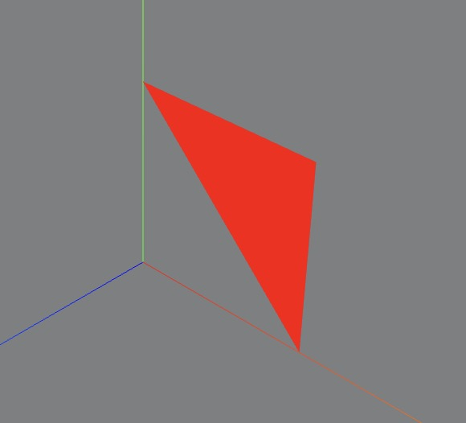
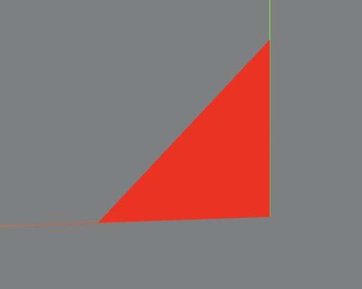

## 集合体顶点位置数据

### BufferGeometry
threejs的长方体BoxGeometry、球体SphereGeometry等几何体都是基于BufferGeometry类构建的

BufferGeometry是一个没有任何形状的空几何体，你可以通过BufferGeometry自定义任何几何形状，具体一点说就是定义顶点数据

### BufferAttribute
任意的几何体都是有顶点的，通过顶点数据组合成一整个完整的几何体

BufferAttribute接收一组buffer数据，这里使用Float32Array方法创建一组xyz数据用于表示几何体的坐标

```js
// 类型化数组创建顶点数据
const vertices = new Float32Array([
  0, 0, 0, //顶点1坐标
  50, 0, 0, //顶点2坐标
  0, 100, 0, //顶点3坐标
  0, 0, 10, //顶点4坐标
  0, 0, 100, //顶点5坐标
  50, 0, 10, //顶点6坐标
]);
```
通过threejs的属性缓冲区对象BufferAttribute表示threejs几何体顶点数据

这里第二个参数代表几个数据构成一个顶点，如果值为2呢，为1呢，为4呢，可以想象之后尝试一下
```js
// 创建属性缓冲区对象
//3个为一组，表示一个顶点的xyz坐标
const attribue = new THREE.BufferAttribute(vertices, 3);
```
接着就是把顶点数据设置给我们前面创建的几何体
```js
geometry.attributes.position = attribue;
```

到这里其实我们的顶点数据就已经完成了

### 点模型
我们使用前面的顶点数据生成一个点模型

点模型Points和网格模型Mesh一样，都是threejs的一种模型对象，只是大部分情况下都是用Mesh表示物体。

```js
// 点渲染模式
const material = new THREE.PointsMaterial({
  color: 0xffff00,
  size: 10.0 //点对象像素尺寸
});
const points = new THREE.Points(geometry, material);
```

### 线模型
一种用于绘制线框样式几何体的材质。

渲染效果是从`第一个点开始到最后一个点，依次连成线`。
```js
const material = new THREE.LineBasicMaterial( {
	color: 0xffffff,
	linewidth: 1,
	linecap: 'round', //ignored by WebGLRenderer
	linejoin:  'round' //ignored by WebGLRenderer
} );
const line = new THREE.Line(geometry, material);
```
#### LineLoop、LineSegments
threejs线模型除了Line，还提供了LineLoop 、LineSegments ，区别在于绘制线条的规则不同

LineLoop：是否首尾相连

LineSegments：每两个顶点连成一条线

### 网格模型
网格模型Mesh其实就一个一个三角形(面)拼接构成。使用网格模型Mesh渲染几何体geometry，就是几何体所有顶点坐标三个为一组，构成一个三角形，多组顶点构成多个三角形，就可以用来模拟表示物体的表面。


三角形是有正反面的

- 正面：逆时针
- 反面：顺时针

空间中一个三角形有正反两面，那么Three.js的规则是如何区分正反面的？非常简单，你的眼睛(相机)对着三角形的一个面，如果三个顶点的顺序是逆时针方向，该面视为正面，如果三个顶点的顺序是顺时针方向，该面视为反面。

#### 可见设置

```js
const material = new THREE.MeshBasicMaterial({
  color: 0x0000ff, //材质颜色
  side: THREE.FrontSide, //默认只有正面可见
  // side: THREE.DoubleSide, //两面可见
  // side: THREE.BackSide, //设置只有背面可见
});
```

尝试用顶点实现一个矩形，矩形顶点设置如下，（前三个顶点是顺时针的）此时你会得到一个这样的图形



这就是正反面的问题，调整一下前三个顶点的顺序就能保证两个三角形都是正面可见了

```js
const vertices = new Float32Array([
  0, 0, 0, //顶点1坐标
  0, 80, 0, //顶点2坐标
  80, 0, 0, //顶点3坐标
  80, 0, 0, //顶点4坐标
  80, 80, 0, //顶点5坐标
  0, 80, 0, //顶点6坐标
]);
```
